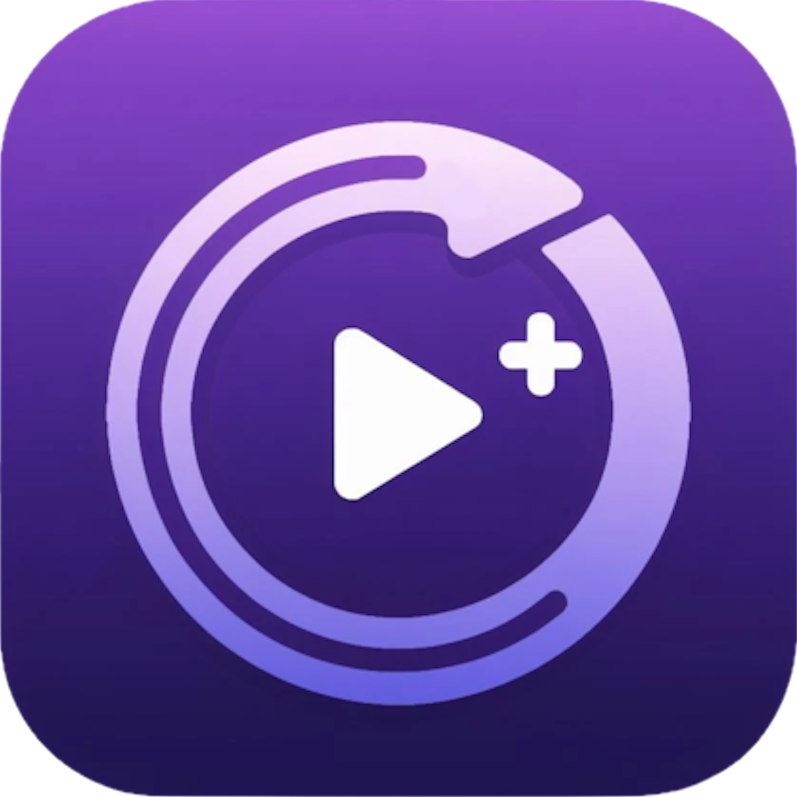

   
  
  <h1 align="center"><b>Twitch Clip Queue</b></h1>
  

    
    
    
    
    
    
  

  

    An enhanced Twitch clip viewing experience.
     
    <a href="https://clipqueue.vercel.app/"><strong>clipqueue.vercel.app »</strong></a>
     
     
  

Twitch Clip Queue is a web application designed to allow users to easily integrate with their [Twitch](https://www.twitch.tv/) chat and queue clips sent from their viewers.

# Features
  - Automatically connect to logged in users Twitch chat to detect clips submitted in chat
  - Duplicate clip prevention
  - Popular clips rise up in the queue
  - Chat commands for moderators ([more info](./docs/COMMANDS.md))
  - Automatic moderation and clip removal
  - Settings customization to personalize the users experience
  - Scan subreddits for posts including Twitch clips
  - Dark and light UI themes

# Additional Documentation
  - [Commands](./docs/COMMANDS.md)
  - [Deployment](./docs/DEPLOYMENT.md)
  - [Development](./docs/DEVELOPMENT.md)
