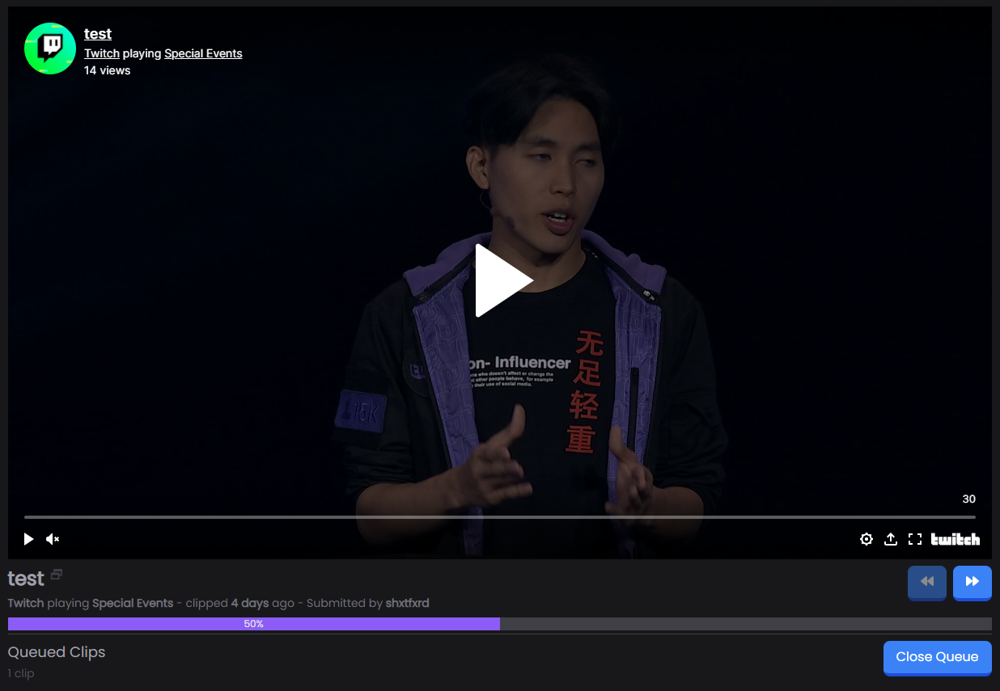

# Clip Queue

Clip Queue is a Vue application created to allow users to easily integrate with their [Twitch](https://www.twitch.tv/) chat and accept clips pasted in chat. These clips are pasted in a queue and allows them to watch clip by clip through the webpage.

## Features
  - Easily connect your chat with Twitch login
  - Clip duplication prevention
  - Popular clips rise up in the queue
  - Clip removal when user is timed-out, banned, or has message deleted
  - Allows channel moderators to open/close the queue and move to the next/previous clip
  - Get clips from subreddit posts automatically
  - Customize settings as you wish
  - Dark and light UI themes

## Screenshot

## More Information
More information can be found in the respective doc in the docs folder.
  - [DEVELOPMENT](./docs/DEVELOPMENT.md)
  - [DEPLOYMENT](./docs/DEPLOYMENT.md)
