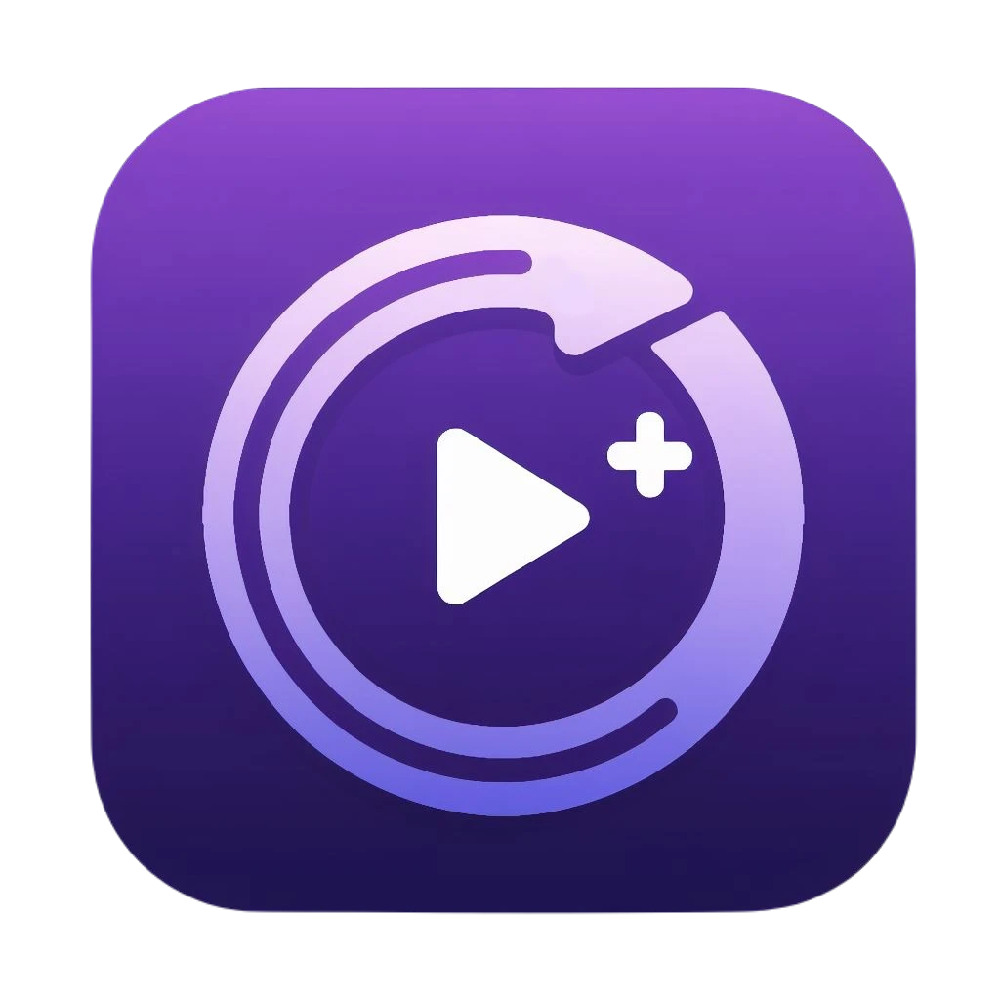

   
  
  <h1 align="center"><b>Clip Queue</b></h1>
  

    An enhanced clip viewing experience.
     
    <a href="https://clipqueue.vercel.app/"><strong>clipqueue.vercel.app »</strong></a>
     
     
  

Clip Queue integrates into a users [Twitch](https://www.twitch.tv/) chat and queues clips sent from their viewers. Clips can be easily viewed through the web interface.

# Features

- Automatically connect to users Twitch chat to detect clips submitted in chat
- Duplicate clip prevention
- Popular clips rise up in the queue
- Support for multiple clip providers (Twitch, Kick, YouTube)
- Chat commands for moderators ([more info](./docs/COMMANDS.md))
- Automatic moderation and clip removal
- Settings customization to personalize user experience
- Dark and light UI themes

# Developer Guide

Please refer to the [contributing guide](CONTRIBUTING.md) for how to install the project for development purposes.

## Monorepo structure:

### Apps:

- `web`: A web application developed using [Vue.js](https://vuejs.org/).

### Packages

- `config`: Common configs shared between other apps and packages in the monorepo.
- `player`: A clip player used for displaying clips developed using [Video JS](https://videojs.com/) and [Vue.js](https://vuejs.org/).
- `providers`: Various clip providers used to get clips developed using [TypeScript](https://www.typescriptlang.org/).
- `services`: Various API clients used to interact with external services developed using [TypeScript](https://www.typescriptlang.org/).
- `ui`: A UI library developed using [Vue.js](https://vuejs.org/), [TailwindCSS](https://tailwindcss.com/), and [PrimeVue](https://primevue.org/).

# Additional Documentation

- [Commands](./docs/COMMANDS.md)
