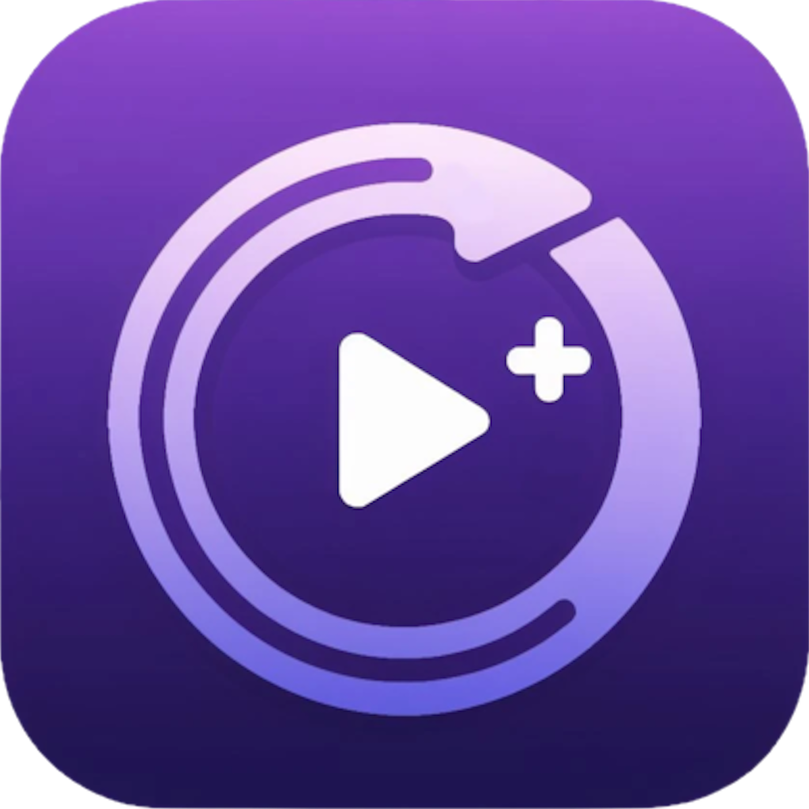

   
  
  <h1 align="center"><b>Clip Queue</b></h1>
  

    An enhanced clip viewing experience.
     
    <a href="https://clipqueue.vercel.app/"><strong>clipqueue.vercel.app »</strong></a>
     
     
  

Clip Queue integrates into a users chat and queues clips submitted in chat by their viewers. Clips can be easily viewed through the web interface.

## Features

- Automatically connect to users chat to detect clips submitted by viewers.
- Duplicate clip prevention.
- Popular clips rise up in the queue.
- Support for multiple integrations:
  - [Twitch](https://www.twitch.tv/)
    - Authentication: `Twitch Authentication`.
    - Providers: `Twitch Clips`, `Twitch Videos`.
    - Sources: `Twitch Chat`.
  - [Kick](https://kick.com/)
    - Providers: `Kick Clips`, `Kick Videos`.
  - [YouTube](https://www.youtube.com/)
    - Providers: `YouTube Shorts`, `YouTube Videos`.
  - Miscellaneous (_Experimental_):
    - Providers:
      - [Dailymotion](https://www.dailymotion.com/)
      - [Soop](https://www.sooplive.com/)
      - [Streamable](https://streamable.com/)
      - [Vimeo](https://vimeo.com/)
- Chat commands available to moderators and broadcasters.
- Automatic moderation and clip removal.
- Settings customization to personalize for your needs.
- UI customization to personalize your experience.
- Multilingual support.

## Developer Guide

Please refer to the [contributing guide](CONTRIBUTING.md) for how to install the project for development purposes.
